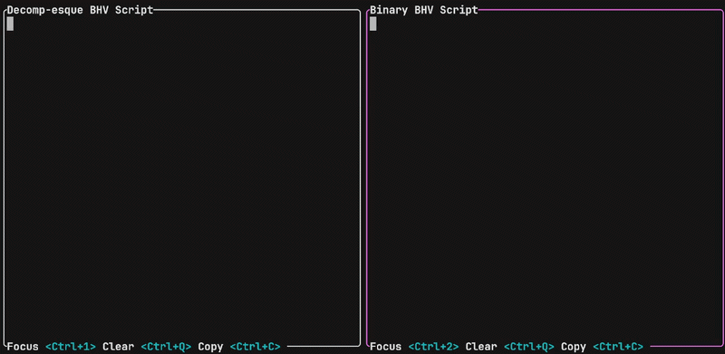
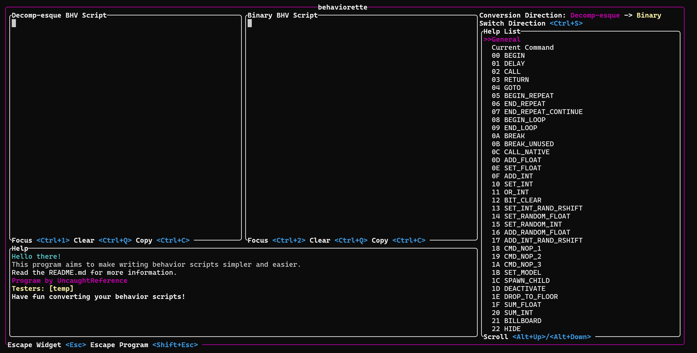

# behaviorette
Converter between a decomp-esque style and pure hex for Super Mario 64 behavior scripts.


## Installation
Download and extract the zip file for the latest version in **Releases**.
**behaviorette** is intended to be run in Windows Terminal. On Windows 11 you can just double-click *behaviorette.exe*. 
On older Windows versions however, you need to do the following:

1. Download and install Windows Terminal from the Microsoft Store
2. In File Explorer, open the folder you unzipped **behaviorette** into
3. Right click on some empty space, and click **Open in Terminal**
4. Type *behaviorette.exe* and press Enter

## UI Overview

There are two windows you can *focus* on: *Decomp-esque BHV Script* (Ctrl+1) and *Binary BHV Script* (Ctrl+2). 
To switch the conversion direction, press Ctrl+S (look at the top-right). You can only type in the BHV Script you're converting *from* 
(so say I'm converting from decomp-esque to binary, I can only type in the decomp-esque window). To clear all code in a window, press Ctrl+Q; to copy it, press Ctrl+C.
The *Help List* on the right controls what information gets displayed in the *Help* window. You can scroll the list using Alt+UpArrow or Alt+DownArrow.
*Current Command* displays information about the... current command you're typing. The rest are command-specific.

## Decomp-esque Syntax
The general syntax is as follows:<br>
```COMMAND(0xVALUE1, 0xVALUE2, etc.)```
<br>Example command:<br>
```OR_INT(0x01, 0x20C9)```
<br>Help for individual commands is displayed in the help window.<br><br>

## General Behavior Script Syntax
Almost every behavior script begins with `BEGIN()`. The *object list* determines which linked list the object gets placed in.
Most fall under `OBJ_LIST_GENACTOR`. So: `BEGIN(OBJ_LIST_GENACTOR)`.<br>
The *object struct* is a data structure that contains information about a given object. Say, its X position, or Y velocity, or action value, etc. 
This struct is accessed by certain behavior commands, using the formula: address = **A*4+0x88**, where A is a byte given in the behavior command's arguments.

<br><br>If you have any questions regarding this program or behavior scripting, feel free to DM me on Discord: **@UncaughtReference** or ping me in the pub server!
## Have fun!


